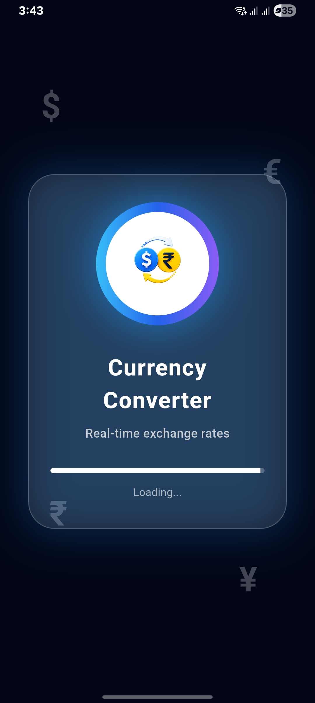
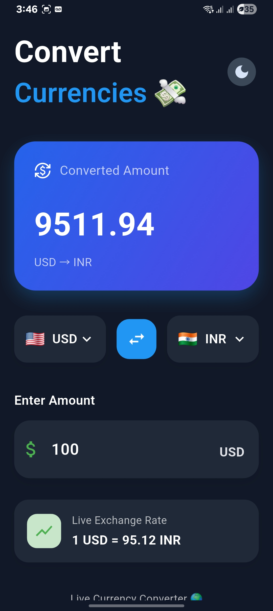
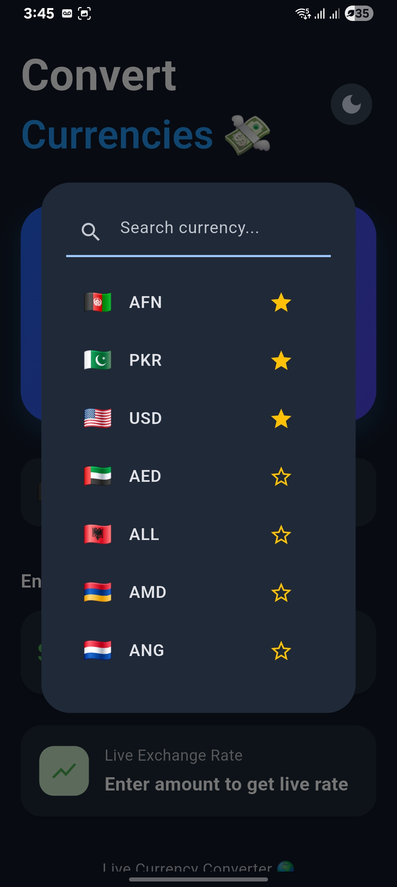
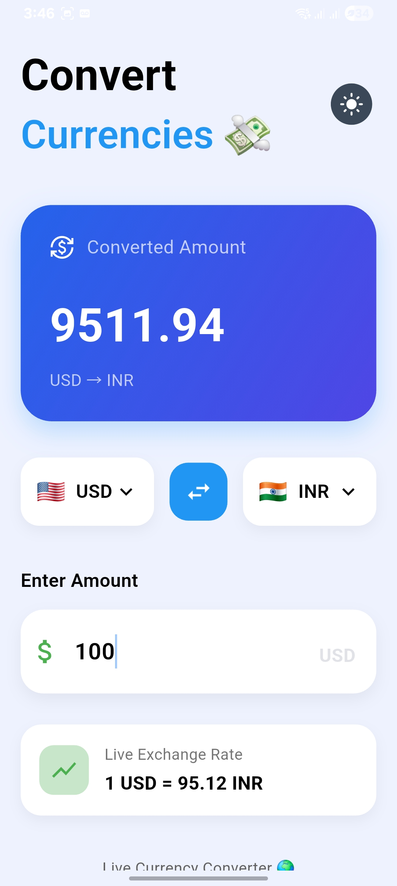

# Currency Converter 🌍

<p align="center">
  A modern Flutter currency converter application with a clean UI, real-time exchange rates, currency search, favourites, and dark/light theme support.
</p>

<p align="center">
  <strong>Built with Flutter & Dart ❤️</strong>
</p>

---

## 📱 About The Project

Currency Converter is a modern Flutter mobile application designed to make currency conversion simple, fast, and easy to use.

The application uses exchange-rate data from a REST API and provides an interactive interface for selecting currencies, entering amounts, viewing converted values, searching currencies, and managing favourite currencies.

This project was built as a practical Flutter project to gain hands-on experience with mobile UI development, REST API integration, local persistence, theme management, and interactive user interfaces.

---

## ✨ Features

### 💱 Currency Conversion

- Convert an amount from one currency to another
- Display the converted amount clearly
- Show the exchange rate between selected currencies
- Support multiple currencies

### 🌐 Real-Time Exchange Rates

- Fetch exchange-rate data from an external API
- Calculate conversions using the latest available rate
- Display the current exchange rate used for conversion

### 🔎 Currency Search

- Search currencies quickly
- Select currencies from an interactive currency list
- Easy-to-use currency selection interface

### ⭐ Favourite Currencies

- Mark frequently used currencies as favourites
- Quickly identify favourite currencies
- Manage favourite currency selections

### 🔄 Currency Swap

- Swap source and target currencies with one tap
- Automatically update the conversion direction

### 🌙 Dark & Light Mode

- Supports both dark and light themes
- Smooth theme switching
- Clean interface in both modes
- Theme preference can be preserved locally

### 🎨 Modern UI

- Clean and modern mobile interface
- Card-based UI design
- Responsive Flutter layout
- Smooth animations and interactions
- Simple and intuitive user experience

### 📡 Connectivity Handling

- Handles API/network errors
- Provides feedback when exchange-rate data cannot be retrieved
- Designed to work with changing network conditions

---

## 📸 Screenshots

### 🚀 Splash Screen

<p align="center">
  
</p>

---

### 🌙 Home Screen — Dark Mode

<p align="center">
  
</p>

---

### 🔎 Currency Selection

<p align="center">
  
</p>

---

### ☀️ Home Screen — Light Mode

<p align="center">
  
</p>

---

## 🛠️ Tech Stack

| Technology | Purpose |
|---|---|
| **Flutter** | Mobile application development |
| **Dart** | Programming language |
| **REST API** | Exchange-rate data |
| **HTTP** | API communication |
| **SharedPreferences** | Local data persistence |
| **Material Design** | UI components and design |

---

## 🧠 What I Practiced

This project helped me gain practical experience with:

- Flutter application development
- Dart programming
- Responsive mobile UI development
- REST API integration
- HTTP requests
- JSON data handling
- Currency conversion logic
- Theme switching
- Dark and light mode implementation
- Local data persistence
- Search functionality
- Favourite functionality
- Currency selection
- Currency swapping
- API error handling
- Interactive UI components
- Mobile application development workflow

---

## 📂 Project Structure

```text
currency-converter-app/
│
├── android/
├── ios/
├── linux/
├── macos/
├── web/
├── windows/
│
├── lib/
│   ├── main.dart
│   ├── splash_screen.dart
│   ├── currency_converter.dart
│   │
│   ├── services/
│   │   └── currency_service.dart
│   │
│   └── utils/
│       └── currency_data.dart
│
├── App_screenshots/
│   ├── currency-converter-dark.png.jpg
│   ├── currency-converter-light.png.jpg
│   ├── currency-selection.png.jpg
│   └── splash-screen.png.jpg
│
├── assets/
│
├── test/
│
├── pubspec.yaml
├── pubspec.lock
├── analysis_options.yaml
└── README.md
